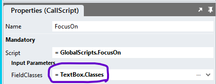

# Focus On

This module allows the cursor to be placed in a specific control. For this purpose, the control should heva a classname in the control `Classes` property that is unique on the page. 


## Version 
1.1 Bug Fix: repeated accordions on reinitialise

1.2 Added scrollbar to wide accordions; changed "OpenFirst" parameter to "OpenAccordion" (int); added functionality to close an open accordion on click of the header; upgraded CSS to work with Stadium 6.12+; updated px to rem

# Setup

## Application Setup
1. Check the *Enable Style Sheet* checkbox in the application properties

## Global Script Setup
1. Create a Global Script called "FocusOn"
2. Add the input parameters below to the Global Script
   1. FieldClasses
3. Drag a *JavaScript* action into the script
4. Add the Javascript below unchanged into the JavaScript code property
```javascript
/* Stadium Script v1.0 https://github.com/stadium-software/focus-on */
let fieldClasses = ~.Parameters.Input.FieldClasses;
let arrFieldClasses = fieldClasses.split(' ');
let controls = document.querySelectorAll(".text-box-container, .drop-down-container, .check-box-container, .check-box-list-container , .radio-button-list-container, .date-picker-container");
for (let i=0; i<controls.length; i++) {
    if (hasAllClasses(controls[i], arrFieldClasses)) {
        let field = controls[i].querySelectorAll("input, select, textarea")[0];
        if (field) field.focus();
        break;
    }
}
function hasAllClasses(element, classArray) {
    return classArray.every(className => element.classList.contains(className));
}
```

## Page Setup
1. Drag a control of type `TextBox`, `DropDown`, `CheckBox`, `ChecBoxList`, `RadioButtonList` or `DatePicker` to a page
2. Add a class of your choosing to the container's *Classes* property that uniqely identifies the field on the page


## Event Handler Setup
1. Drag the Global Script called "FocusOn" into an event handler
2. Provide values for the scripts input parameters
   1. FieldClasses: Select the `Classes` property from the control you wish to focus on



## Upgrading Stadium Repos
Stadium Repos are not static. They change as additional features are added and bugs are fixed. Using the right method to work with Stadium Repos allows for upgrading them in a controlled manner. 

How to use and update application repos is described here: [Working with Stadium Repos](https://github.com/stadium-software/samples-upgrading)